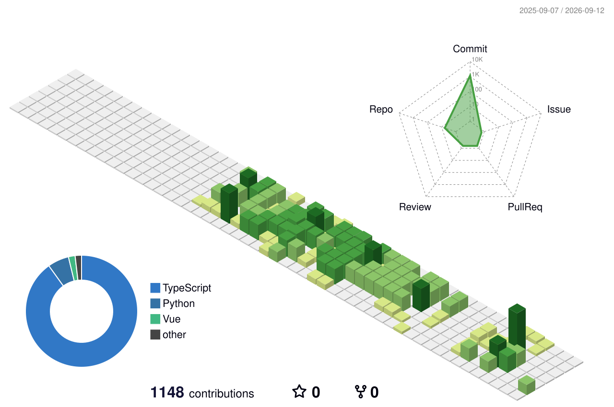

---

### ⌨️**Skills**

  
  
  
  
  
  
  
  

---

### 🏆**Careers**

**2026.01.18 ~ now 15th Samsung SW AI academy For Youth**\
**2026.06.26 [기업 사내 전산 관리를 위한 ERP 시스템] / 🥈우수상 수상 / SSAFY**

---

### 📒​**Projects**

**Ait Project (AI 모의 면접 & 모의 면접 스터디 플랫폼)**\
**ERP Project (기업 사내 ERP 시스템)**

---

### 📑**Certifications**

**2026.03.27 SQL 개발자(SQLD) 취득**\
**2026.06.05 데이터 분석 준전문가(ADsP) 취득**\
**2026.09.11 정보처리기사 취득**

---

### 🌱**My Garden**

